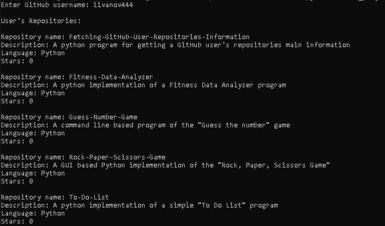

# Fetching-GitHub-User-Repositories-Information
A python program for getting a GitHub user's repositories main information

## Dependencies
1. Git - https://git-scm.com/downloads
2. Python - https://www.python.org/downloads/
3. Python requests module - in Terminal -> pip install requests

## Installation
1. Choose a folder where to download it
2. Open Git Bash in it
3. Type or copy & paste: git clone https://github.com/iivanov444/Fetching-GitHub-User-Repositories-Information

## Usage
Open Terminal(Windows: PowerShell, Linux: Bash, MacOS: Terminal)
and type or copy & paste: python main_program.py

## Examples
Run the program and it will prompt to type a GitHub username, if it's not valid or doesn't exist it will display error, otherwise it will display:

User's Repositories:

Repository name: ExampleOne-Repository  
Description: An example some repository  
Language: Fortran  
Stars: 1  

Repository name: ExampleTwo-Repository  
Description: An example some repository  
Language: C  
Stars: 2  

Repository name: ExampleTwo-Repository  
Description: An example some repository  
Language: C++  
Stars: 3  

Repository name: ExampleTwo-Repository  
Description: An example some repository  
Language: HolyC  
Stars: 4  

## License
MIT License
